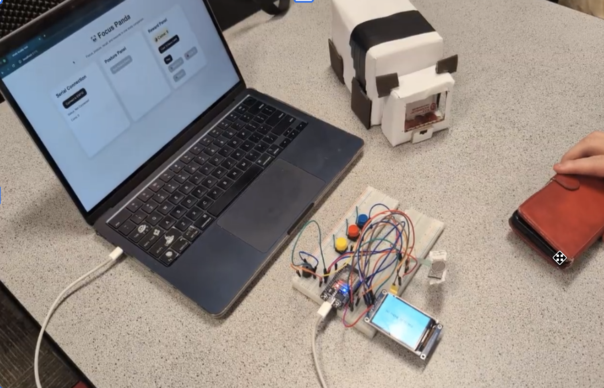
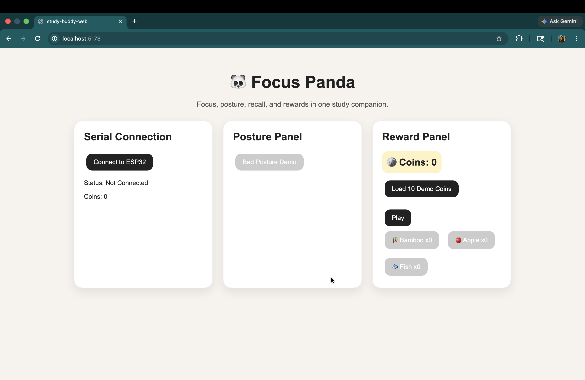
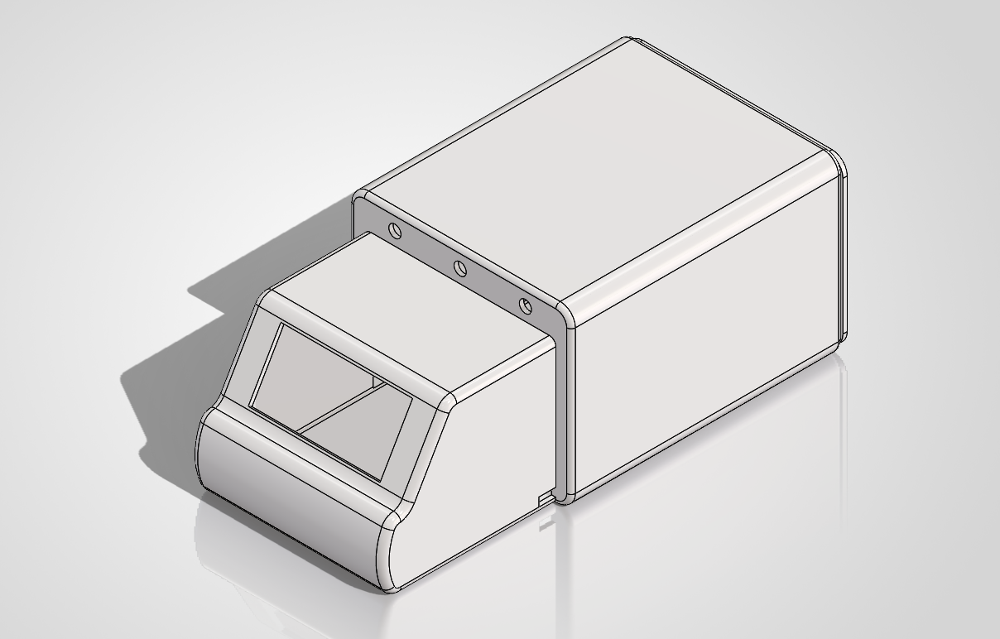
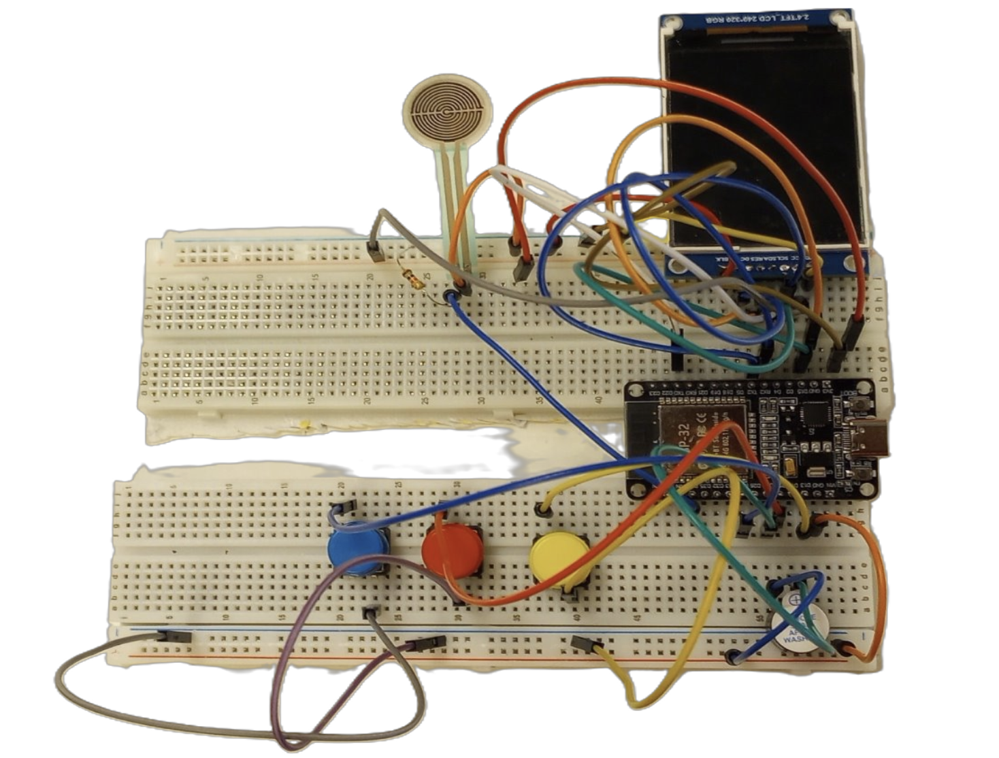

# Focus Panda | AI Assisted Robotic Study Companion

  

Focus Panda is an interactive robotic study companion designed to reduce phone distraction, improve study consistency, and increase motivation through physical interaction and reward based feedback.

---

## Features

* ESP32 powered Pomodoro study system
* Phone detection using Force Sensitive Resistor
* Animated TFT Panda display
* Interactive reward system
* Real time Web Serial communication
* Hardware and software integration
* Custom web interface
* Physical prototype and CAD development

---

## Technologies Used

ESP32 • Arduino IDE • React • Vite • JavaScript • Web Serial API • SolidWorks • SPI Communication • 3D Printing

---

## System Overview

The system combines an ESP32 based robotic companion with a connected web application.

### Microcontroller Subsystem

Handles:
* timer logic
* sensor input
* display output
* buzzer feedback
* button interaction
* serial communication

### Website Subsystem

Handles:
* rewards
* session tracking
* user interaction
* browser communication
* visual feedback

---

## Project Gallery
<table align="center">
<tr>
<td align="center">
 
Website Interface
</td>

<td align="center">
 
CAD Design
</td>
</tr>

<tr>
<td align="center">
 
Electronics and Wiring
</td>

<td align="center">
 
Final Prototype
</td>
</tr>
</table>

---

## Demo

[Watch Demo Video](https://drive.google.com/file/d/1s7SQlK8_ux6w9GD-FN52YMqhcUe0XBht/view?usp=drive_link)

---

## Lead Development Contributions

### Eva Batdorj

* Embedded systems programming
* Full stack web development
* Web Serial integration
* Hardware and software integration
* UI and UX design
* CAD modeling and prototyping
* System testing and validation
* Research and technical documentation

---

## Research Poster

[View Poster](docs/poster/focus-panda-poster.pdf)

---

Engineering Projects  
Instructor: Jacob Wikowsky
